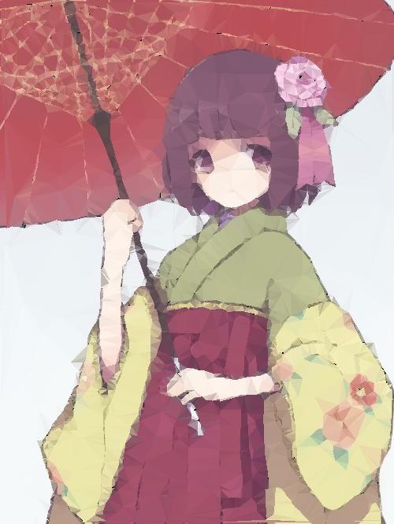
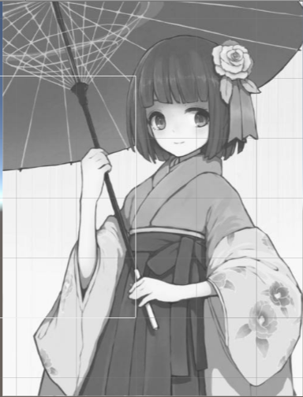

# 对图片进行低多边形渲染

## 前言

在本个项目当中，尝试着对图片进行低多边形化，从而完成对一张图片进行低多边形的渲染。目标是达到能够制作比较好看的低多边形化的图片。

以下就是其中一种渲染的结果



## 概况

目前，实现对图片的低多边形渲染的方式有很多种，而这只是其中最简单的一种。不过，无论是什么样的低多边形渲染，实现的过程则是大同小异的。

将其实现的过程简单来说就是

    ·1 将图片的边缘区域找出来，形成一个线的集合
    ·2 根据图片的线的集合生成一个点集
    ·3 根据点集形成三角面
    ·4 上色

从步骤来说，这个实现确实比较简单

## 实现过程

关于本次低多边形的渲染的实现，我是参考了两篇论文
>[Artistic Low Poly rendering for image](https://link.springer.com/article/10.1007/s00371-015-1082-2#Fig4)  
[Low-Poly Style Image and Vedio Processing](https://ieeexplore.ieee.org/document/7314186)

第一篇论文主要讲述的是如何生成艺术感十足的低多边形图片，而第二篇则是一个比较简单的低多边形图片的实现方法，我在这主要参考的是第二篇的文章来实现的

实现工具为Unity

## 实现思路

第一步，找出图片的边缘的集合。找出一个图片的边缘的集合比较简单，简单的使用`Sobel算法`即可实现。

### Sobel算法

#### 原理
Sobel算法是一种边缘推导的算法，他可以计算出图片的边缘，当然，首先这个图片是灰度图，然后，计算每一个像素的x与y方向的灰度的偏导，当这个偏导十分大的时候，说明了这个图片的这个位置与其他位置的颜色的差别很大，那么我们就可以认为这是一个图片的边缘像素

#### 实现
首先是灰度图
```
return (float) (0.29899999499321 * (double) this.r + 0.587000012397766 * (double) this.g + 57.0 / 500.0 * (double) this.b);
```
灰度图就是一个对一个图片的RGB值进行一个按比例的取值，之后就可以计算出一个图片的灰度值了


得到灰度图之后就可以对其进行Sobel的算子的运算了$$\begin{Bmatrix}1 & 0 & -1\\\\2  & 0 & -2 \\\\ 1 & 0 & 1 \end{Bmatrix}$$